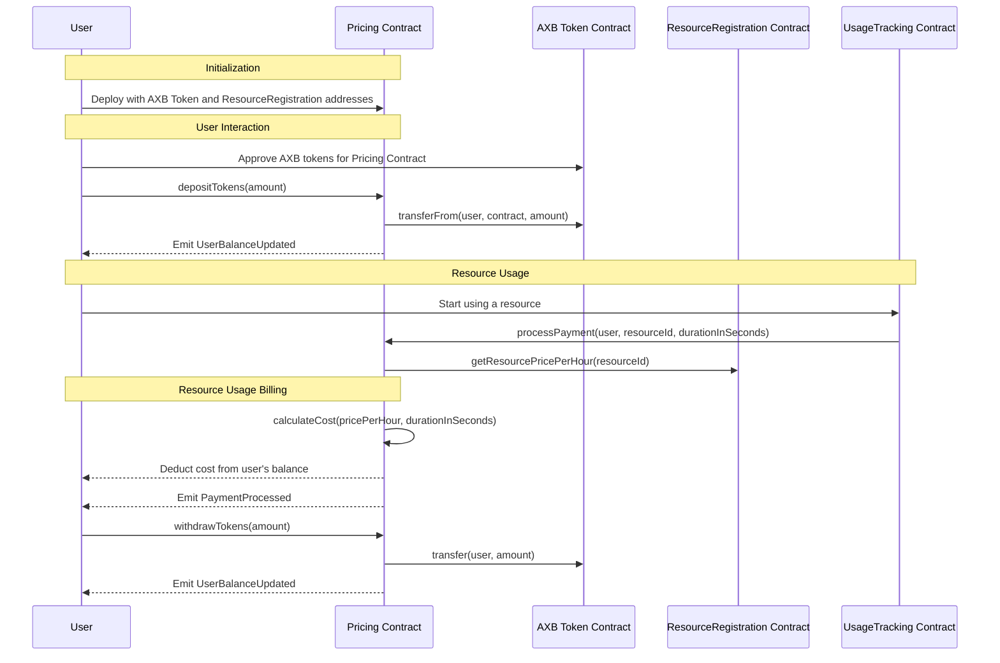

Smart Contract Logic:

The Decentralized Compute MarketPlace include some of smart contracts:

* AXBToken.sol
* ResourceRegistration.sol
* Pricing.sol
* UsageTracking.sol

# **AXBToken.sol** for testing:

```solidity

// SPDX-License-Identifier: MIT
pragma solidity ^0.8.0;

import "@openzeppelin/contracts/token/ERC20/ERC20.sol";

contract AXBToken is ERC20 {
    constructor(
        string memory name,
        string memory symbol,
        uint256 initialSupply
    ) ERC20(name, symbol){
        _mint(msg.sender, initialSupply);
    }
}

```

# **SC 1: Resource Registration Contract** :

* Handles the registration of compute resources, regardless of whether:

  * provided by your infrastructure,
  * hosted on the user's infrastructure,
  * decentralized marketplace.

    The `ResourceRegistration` contract is designed to manage and track computing resources in our decentralized compute marketplace. It allows ***resource owners to register various types of computing*** resources, such as

    * labeling tools,
    * storage,
    * ML notebooks,
    * and ML training capabilities,
      along with their specifications (CPU, GPU, RAM, disk space) and rental price.

| **Component**              | **Description**                                                                                                                                                                                                                                                                                                                                                                       |
| -------------------------------- | ------------------------------------------------------------------------------------------------------------------------------------------------------------------------------------------------------------------------------------------------------------------------------------------------------------------------------------------------------------------------------------------- |
| **Resource Struct**        | Defines the attributes of a computing resource:<br />**ID, type, provider, CPU, GPU, RAM, disk, price per hour, and availability**.                                                                                                                                                                                                                                                   |
| **State Variables**        | -`resources`: Dynamic array storing all resources.<br />-`resourceToOwner`: Maps resource ID to owner's address.<br />-`nextResourceId`: Tracks ID for the next resource.                                                                                                                                                                                                             |
| **Events**                 | -`ResourceRegistered`: Logs new resource registration.<br />-`ResourceUpdated`: Logs updates to a resource.<br />-`ResourceAvailabilityChanged`: Logs changes in resource availability.                                                                                                                                                                                               |
| **Modifier**               | -`onlyResourceOwner`: Restricts certain actions to the resource's owner.                                                                                                                                                                                                                                                                                                                  |
| **Functions**              | -`registerResource`: Registers a new resource.<br />-`getResourcePricePerHour`: Gets the price per hour of a resource.<br />-`updateResource`: Updates resource details.<br />-`setResourceAvailability`: Changes a resource's availability.<br />-`getResource`: Retrieves details of a resource.<br />-`getTotalResources`: Returns the total number of registered resources. |
| **Usage and Implications** | The contract facilitates a decentralized marketplace for computing resources, allowing for diverse computing needs to be met. It ensures resource integrity and ownership.                                                                                                                                                                                                                  |

**Draft code:**span

```solidity
// SPDX-License-Identifier: MIT
pragma solidity ^0.8.0;

contract ResourceRegistration {
    struct Resource {
        uint256 id;
        string resourceType; // LabelingTool, Storage, MLNotebook, MLTraining
        string provider; // e.g., "Intel"
        uint256 cpu; // Number of CPUs for the resource
        uint256 gpu; // Number of GPUs for the resource
        uint256 ram; // Amount of RAM in GB
        uint256 disk; // Disk space in GB
        uint256 pricePerHour; // Price per hour in tokens
        bool available; // Availability of the resource
    }

    Resource[] public resources;
    mapping(uint256 => address) public resourceToOwner; // Maps resource ID to owner address
    uint256 public nextResourceId = 0;

    // Events
    event ResourceRegistered(uint256 indexed resourceId, string resourceType, string provider);
    event ResourceUpdated(uint256 indexed resourceId);
    event ResourceAvailabilityChanged(uint256 indexed resourceId, bool available);

    // Modifier to restrict actions to the resource owner
    modifier onlyResourceOwner(uint256 resourceId) {
        require(resourceToOwner[resourceId] == msg.sender, "Caller is not the resource owner");
        _;
    }

    // Register a new resource
    function registerResource(string memory _resourceType, string memory _provider, uint256 _cpu, uint256 _gpu, uint256 _ram, uint256 _disk, uint256 _pricePerHour) public {
        resources.push(Resource(nextResourceId, _resourceType, _provider, _cpu, _gpu, _ram, _disk, _pricePerHour, true));
        resourceToOwner[nextResourceId] = msg.sender;
        emit ResourceRegistered(nextResourceId, _resourceType, _provider);
        nextResourceId++;
    }

    // Make sure this function is defined and marked as public or external
    function getResourcePricePerHour(uint256 resourceId) external view returns (uint256) {
        require(resourceId < nextResourceId, "Resource does not exist");
        return resources[resourceId].pricePerHour;
    }

    // Update resource details
    function updateResource(uint256 _id, uint256 _cpu, uint256 _gpu, uint256 _ram, uint256 _disk, uint256 _pricePerHour) public onlyResourceOwner(_id) {
        Resource storage resource = resources[_id];
        resource.cpu = _cpu;
        resource.gpu = _gpu;
        resource.ram = _ram;
        resource.disk = _disk;
        resource.pricePerHour = _pricePerHour;
        emit ResourceUpdated(_id);
    }

    // Change the availability of a resource
    function setResourceAvailability(uint256 _id, bool _available) public onlyResourceOwner(_id) {
        Resource storage resource = resources[_id];
        resource.available = _available;
        emit ResourceAvailabilityChanged(_id, _available);
    }

    // Get details of a resource
    function getResource(uint256 _id) public view returns (Resource memory) {
        require(_id < nextResourceId, "Resource does not exist");
        return resources[_id];
    }

    // Get total number of resources
    function getTotalResources() public view returns (uint256) {
        return nextResourceId;
    }
}

```

# **Pricing.sol**

* **AXB Token Integration** :
  * This (Pricning contract)) contract integrates with an ERC20 token (AXB) for handling payments.
  * Users must have AXB tokens and approve the `Pricing` contract to spend tokens on their behalf.
* **Resource Registration Contract** :
  * Interacts with the `ResourceRegistration` contract to obtain resource-related information, particularly the `pricePerHour` for calculating the usage cost.
* **User Balances** :
  * Tracks AXB token deposits within the contract for each user. This balance is used to pay for resource usage.
* **Events** :
  * `PaymentProcessed`:
    * Emitted after successfully processing a payment,
    * detailing the user, amount, and resource ID.
  * `UserBalanceUpdated`:
    * Signals a change in a user's balance within the contract,
    * either due to a deposit or withdrawal.
* **Deposits and Withdrawals** :
  * Users deposit AXB tokens into their balance with `depositTokens`. This is required before using payable resources.
  * Users can withdraw their unused AXB tokens with `withdrawTokens`.
* **Payment Processing** :
  * The `processPayment` function is called externally (presumably by a `UsageTracking` contract) to charge users based on resource usage.
  * **It calculates the cost based on the resource's hourly rate and the duration of usage.
  * **Ensures the user has sufficient balance to cover the cost and deducts the calculated amount.
* **Cost Calculation** :
  * The `calculateCost` helper function computes the usage cost based on the resource's `pricePerHour` and the usage duration in seconds, converting the duration to hours for billing purposes.



```solidity
// SPDX-License-Identifier: MIT
pragma solidity ^0.8.0;

import "@openzeppelin/contracts/token/ERC20/IERC20.sol";
import "@openzeppelin/contracts/security/ReentrancyGuard.sol";
import "@openzeppelin/contracts/access/Ownable.sol";
import "./ResourceRegistration.sol";


contract Pricing is Ownable, ReentrancyGuard {
    IERC20 public axbToken;
    ResourceRegistration public resourceRegistration;

    mapping(address => uint256) public userBalances;

    event PaymentProcessed(address indexed user, uint256 amount, uint256 resourceId);
    event UserBalanceUpdated(address indexed user, uint256 newBalance);

    constructor(address _axbTokenAddress, address _resourceRegistrationAddress)
        Ownable(msg.sender) {
        axbToken = IERC20(_axbTokenAddress);
        resourceRegistration = ResourceRegistration(_resourceRegistrationAddress);
    }

    // Function for users to deposit AXB tokens into their balance within the contract
    function depositTokens(uint256 amount) external nonReentrant {
        require(axbToken.transferFrom(msg.sender, address(this), amount), "Transfer failed");
        userBalances[msg.sender] += amount;
        emit UserBalanceUpdated(msg.sender, userBalances[msg.sender]);
    }

    // Users can withdraw their unused AXB tokens
    function withdrawTokens(uint256 amount) external nonReentrant {
        require(userBalances[msg.sender] >= amount, "Insufficient balance");
        userBalances[msg.sender] -= amount;
        require(axbToken.transfer(msg.sender, amount), "Transfer failed");
        emit UserBalanceUpdated(msg.sender, userBalances[msg.sender]);
    }

    // Called by the UsageTracking contract to process payment for a resource usage session
    function processPayment(address user, uint256 resourceId, uint256 durationInSeconds) external nonReentrant {
        uint256 pricePerHour = resourceRegistration.getResourcePricePerHour(resourceId);
        uint256 cost = calculateCost(pricePerHour, durationInSeconds);

        require(userBalances[user] >= cost, "Insufficient balance for payment");
        userBalances[user] -= cost;
        emit PaymentProcessed(user, cost, resourceId);
    }

    // Helper function to calculate the cost based on usage duration and price per hour
    function calculateCost(uint256 pricePerHour, uint256 durationInSeconds) public pure returns (uint256) {
        return pricePerHour * durationInSeconds / 3600;
    }

    // Additional helper functions for balance inquiries, etc.
}

```

# Smart Contract 3: UsageTracking.sol
