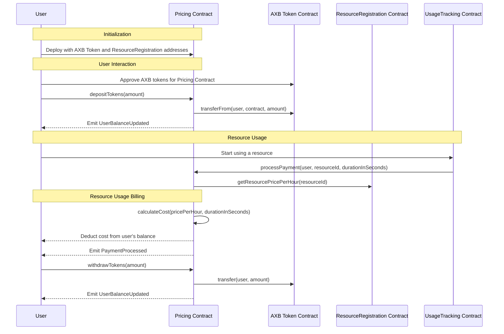
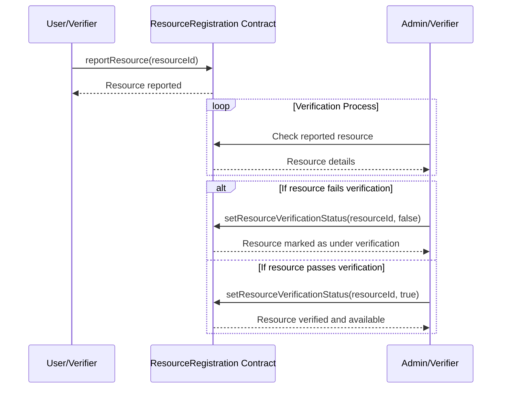

# Smart Contract Logic:

The Decentralized Compute MarketPlace include some of smart contracts:

* AXBToken.sol
* ResourceRegistration.sol
* Pricing.sol
* UsageTracking.sol

# **AXBToken.sol** for testing:

```solidity

// SPDX-License-Identifier: MIT
pragma solidity ^0.8.0;

import "@openzeppelin/contracts/token/ERC20/ERC20.sol";

contract AXBToken is ERC20 {
    constructor(
        string memory name,
        string memory symbol,
        uint256 initialSupply
    ) ERC20(name, symbol){
        _mint(msg.sender, initialSupply);
    }
}

```

# **SC 1: Resource Registration Contract** :

* Handles the registration of compute resources, regardless of whether:

  * provided by your infrastructure,
  * hosted on the user's infrastructure,
  * decentralized marketplace.

    The `ResourceRegistration` contract is designed to manage and track computing resources in our decentralized compute marketplace. It allows ***resource owners to register various types of computing*** resources, such as

    * labeling tools,
    * storage,
    * ML notebooks,
    * and ML training capabilities,
      along with their specifications (CPU, GPU, RAM, disk space) and rental price.

| **Component**              | **Description**                                                                                                                                                                                                                                                                                                                                                                       |
| -------------------------------- | ------------------------------------------------------------------------------------------------------------------------------------------------------------------------------------------------------------------------------------------------------------------------------------------------------------------------------------------------------------------------------------------- |
| **Resource Struct**        | Defines the attributes of a computing resource:<br />**ID, type, provider, CPU, GPU, RAM, disk, price per hour, and availability**.                                                                                                                                                                                                                                                   |
| **State Variables**        | -`resources`: Dynamic array storing all resources.<br />-`resourceToOwner`: Maps resource ID to owner's address.<br />-`nextResourceId`: Tracks ID for the next resource.                                                                                                                                                                                                             |
| **Events**                 | -`ResourceRegistered`: Logs new resource registration.<br />-`ResourceUpdated`: Logs updates to a resource.<br />-`ResourceAvailabilityChanged`: Logs changes in resource availability.                                                                                                                                                                                               |
| **Modifier**               | -`onlyResourceOwner`: Restricts certain actions to the resource's owner.                                                                                                                                                                                                                                                                                                                  |
| **Functions**              | -`registerResource`: Registers a new resource.<br />-`getResourcePricePerHour`: Gets the price per hour of a resource.<br />-`updateResource`: Updates resource details.<br />-`setResourceAvailability`: Changes a resource's availability.<br />-`getResource`: Retrieves details of a resource.<br />-`getTotalResources`: Returns the total number of registered resources. |
| **Usage and Implications** | The contract facilitates a decentralized marketplace for computing resources, allowing for diverse computing needs to be met. It ensures resource integrity and ownership.                                                                                                                                                                                                                  |

**Draft code:**span

```solidity
// SPDX-License-Identifier: MIT
pragma solidity ^0.8.0;

contract ResourceRegistration {
    struct Resource {
        uint256 id;
        string resourceType; // LabelingTool, Storage, MLNotebook, MLTraining
        string provider; // e.g., "Intel"
        uint256 cpu; // Number of CPUs for the resource
        uint256 gpu; // Number of GPUs for the resource
        uint256 ram; // Amount of RAM in GB
        uint256 disk; // Disk space in GB
        uint256 pricePerHour; // Price per hour in tokens
        bool available; // Availability of the resource
    }

    Resource[] public resources;
    mapping(uint256 => address) public resourceToOwner; // Maps resource ID to owner address
    uint256 public nextResourceId = 0;

    // Events
    event ResourceRegistered(uint256 indexed resourceId, string resourceType, string provider);
    event ResourceUpdated(uint256 indexed resourceId);
    event ResourceAvailabilityChanged(uint256 indexed resourceId, bool available);

    // Modifier to restrict actions to the resource owner
    modifier onlyResourceOwner(uint256 resourceId) {
        require(resourceToOwner[resourceId] == msg.sender, "Caller is not the resource owner");
        _;
    }

    // Register a new resource
    function registerResource(string memory _resourceType, string memory _provider, uint256 _cpu, uint256 _gpu, uint256 _ram, uint256 _disk, uint256 _pricePerHour) public {
        resources.push(Resource(nextResourceId, _resourceType, _provider, _cpu, _gpu, _ram, _disk, _pricePerHour, true));
        resourceToOwner[nextResourceId] = msg.sender;
        emit ResourceRegistered(nextResourceId, _resourceType, _provider);
        nextResourceId++;
    }

    // Make sure this function is defined and marked as public or external
    function getResourcePricePerHour(uint256 resourceId) external view returns (uint256) {
        require(resourceId < nextResourceId, "Resource does not exist");
        return resources[resourceId].pricePerHour;
    }

    // Update resource details
    function updateResource(uint256 _id, uint256 _cpu, uint256 _gpu, uint256 _ram, uint256 _disk, uint256 _pricePerHour) public onlyResourceOwner(_id) {
        Resource storage resource = resources[_id];
        resource.cpu = _cpu;
        resource.gpu = _gpu;
        resource.ram = _ram;
        resource.disk = _disk;
        resource.pricePerHour = _pricePerHour;
        emit ResourceUpdated(_id);
    }

    // Change the availability of a resource
    function setResourceAvailability(uint256 _id, bool _available) public onlyResourceOwner(_id) {
        Resource storage resource = resources[_id];
        resource.available = _available;
        emit ResourceAvailabilityChanged(_id, _available);
    }

    // Get details of a resource
    function getResource(uint256 _id) public view returns (Resource memory) {
        require(_id < nextResourceId, "Resource does not exist");
        return resources[_id];
    }

    // Get total number of resources
    function getTotalResources() public view returns (uint256) {
        return nextResourceId;
    }
}

```

# **Smart Contract 2: Pricing.sol**

* **AXB Token Integration** :
  * This (Pricning contract)) contract integrates with an ERC20 token (AXB) for handling payments.
  * Users must have AXB tokens and approve the `Pricing` contract to spend tokens on their behalf.
* **Resource Registration Contract** :
  * Interacts with the `ResourceRegistration` contract to obtain resource-related information, particularly the `pricePerHour` for calculating the usage cost.
* **User Balances** :
  * Tracks AXB token deposits within the contract for each user. This balance is used to pay for resource usage.
* **Events** :
  * `PaymentProcessed`:
    * Emitted after successfully processing a payment,
    * detailing the user, amount, and resource ID.
  * `UserBalanceUpdated`:
    * Signals a change in a user's balance within the contract,
    * either due to a deposit or withdrawal.
* **Deposits and Withdrawals** :
  * Users deposit AXB tokens into their balance with `depositTokens`. This is required before using payable resources.
  * Users can withdraw their unused AXB tokens with `withdrawTokens`.
* **Payment Processing** :
  * The `processPayment` function is called externally (presumably by a `UsageTracking` contract) to charge users based on resource usage.
  * **It calculates the cost based on the resource's hourly rate and the duration of usage.
  * **Ensures the user has sufficient balance to cover the cost and deducts the calculated amount.
* **Cost Calculation** :
  * The `calculateCost` helper function computes the usage cost based on the resource's `pricePerHour` and the usage duration in seconds, converting the duration to hours for billing purposes.
  * in the `Pricing` and `UsageTracking` contracts, focusing on a pay-as-you-go model.

### a. Pricing Calculation Equation

The cost of using a computing resource in the marketplace is typically calculated based on the duration of usage and the resource's price per hour.

The equation for calculating the price (`Cost`) of a usage session is:

`Cost=(Duration in seconds / 3600)×Price per Hour `

**Where**:

* **Duration in seconds**:
  * is the length of the usage session, calculated as the difference between the session's end time and start time.
* **Price per Hour:**
  * is the cost of using the resource for one hour, specified when the resource is registered.

### b. Detailed Logic for Pricing and Usage Tracking

* **step 1: Resource Registration**

  * **Resource Capability** : When a resource is registered (`registerResource` function), its specifications, including `maxConcurrentSessions` and `pricePerHour`, are stored. This sets the basis for capacity checks and pricing.
* **step 2: Session Management** in `UsageTracking`

  * **Session Start** (`startSession`):
    * Checks if the resource is available and not exceeding its `maxConcurrentSessions`.
    * Records the `startTime` of the session, the `resourceId`, and the user's address.
* **Step 3: Session End** (`endSession`):

  * Validates that the session is active and that the user ending the session is the one who started it.
  * Records the `endTime` of the session.
  * Calls the `Pricing` contract to calculate the cost based on the usage duration and resource's price per hour.
* **Price Calculation** in `Pricing`

  * **Calculate Cost and Deduct Balance** :
    * Upon receiving details of a session's end (`endSession`), the `Pricing` contract calculates the cost using the equation provided.
    * Deducts the calculated cost from the user's pre-deposited balance.
    * Handles insufficient balance errors by reverting the transaction or flagging the user/session for manual review.
* **Example**:

  * iff a user utilizes a GPU for training with a `pricePerHour` of 0.05 ETH for 7200 seconds (2 hours), the cost calculation would be:
    *Cost  =(7200/3600)×0.05 AXB = 0.1 AXB*



```solidity
// SPDX-License-Identifier: MIT
pragma solidity ^0.8.0;

import "@openzeppelin/contracts/token/ERC20/IERC20.sol";
import "@openzeppelin/contracts/security/ReentrancyGuard.sol";
import "@openzeppelin/contracts/access/Ownable.sol";
import "./ResourceRegistration.sol";


contract Pricing is Ownable, ReentrancyGuard {
    IERC20 public axbToken;
    ResourceRegistration public resourceRegistration;

    mapping(address => uint256) public userBalances;

    event PaymentProcessed(address indexed user, uint256 amount, uint256 resourceId);
    event UserBalanceUpdated(address indexed user, uint256 newBalance);

    constructor(address _axbTokenAddress, address _resourceRegistrationAddress)
        Ownable(msg.sender) {
        axbToken = IERC20(_axbTokenAddress);
        resourceRegistration = ResourceRegistration(_resourceRegistrationAddress);
    }

    // Function for users to deposit AXB tokens into their balance within the contract
    function depositTokens(uint256 amount) external nonReentrant {
        require(axbToken.transferFrom(msg.sender, address(this), amount), "Transfer failed");
        userBalances[msg.sender] += amount;
        emit UserBalanceUpdated(msg.sender, userBalances[msg.sender]);
    }

    // Users can withdraw their unused AXB tokens
    function withdrawTokens(uint256 amount) external nonReentrant {
        require(userBalances[msg.sender] >= amount, "Insufficient balance");
        userBalances[msg.sender] -= amount;
        require(axbToken.transfer(msg.sender, amount), "Transfer failed");
        emit UserBalanceUpdated(msg.sender, userBalances[msg.sender]);
    }

    // Called by the UsageTracking contract to process payment for a resource usage session
    function processPayment(address user, uint256 resourceId, uint256 durationInSeconds) external nonReentrant {
        uint256 pricePerHour = resourceRegistration.getResourcePricePerHour(resourceId);
        uint256 cost = calculateCost(pricePerHour, durationInSeconds);

        require(userBalances[user] >= cost, "Insufficient balance for payment");
        userBalances[user] -= cost;
        emit PaymentProcessed(user, cost, resourceId);
    }

    // Helper function to calculate the cost based on usage duration and price per hour
    function calculateCost(uint256 pricePerHour, uint256 durationInSeconds) public pure returns (uint256) {
        return pricePerHour * durationInSeconds / 3600;
    }

    // Additional helper functions for balance inquiries, etc.
}

```

# Smart Contract 3: UsageTracking.sol

```solidity
// SPDX-License-Identifier: MIT
pragma solidity ^0.8.0;

import "./ResourceRegistration.sol";
import "./Pricing.sol";

contract UsageTracking {
    ResourceRegistration public resourceRegistration;
    Pricing public pricingContract;

    struct UsageSession {
        uint256 resourceId;
        address user;
        uint256 startTime;
        uint256 endTime;
    }

    mapping(uint256 => UsageSession) public sessions;
    uint256 public nextSessionId = 0;

    event SessionStarted(uint256 indexed sessionId, uint256 indexed resourceId, address user);
    event SessionEnded(uint256 indexed sessionId, uint256 indexed resourceId, address user);

    constructor(address _resourceRegistrationAddress, address _pricingAddress) {
        resourceRegistration = ResourceRegistration(_resourceRegistrationAddress);
        pricingContract = Pricing(_pricingAddress);
    }

    function startSession(uint256 _resourceId) external {
        require(resourceRegistration.isResourceAvailable(_resourceId), "Resource not available");
  
        sessions[nextSessionId] = UsageSession({
            resourceId: _resourceId,
            user: msg.sender,
            startTime: block.timestamp,
            endTime: 0
        });
  
        emit SessionStarted(nextSessionId, _resourceId, msg.sender);
        nextSessionId++;
    }

    function endSession(uint256 _sessionId) external {
        UsageSession storage session = sessions[_sessionId];
        require(msg.sender == session.user, "Only the session initiator can end it");
        require(session.endTime == 0, "Session already ended");

        session.endTime = block.timestamp;
  
        emit SessionEnded(_sessionId, session.resourceId, msg.sender);

        // Notify the Pricing contract to calculate and deduct cost
        uint256 duration = session.endTime - session.startTime;
        pricingContract.calculateCost(session.resourceId, session.user, duration);
    }
}

```

# **Scenarios & Solution**:

| Scenario | Description                                                                                                                                                      | Solution                                                                                                                                                                                                                                                                                                                                                                                                                                                                                                                                                                                                                                                                                                                                                                         | Update to Smart Contract                                                                                                                                                                                                                                                                                                                                                                                                                                                                                                                                          |
| -------- | ---------------------------------------------------------------------------------------------------------------------------------------------------------------- | -------------------------------------------------------------------------------------------------------------------------------------------------------------------------------------------------------------------------------------------------------------------------------------------------------------------------------------------------------------------------------------------------------------------------------------------------------------------------------------------------------------------------------------------------------------------------------------------------------------------------------------------------------------------------------------------------------------------------------------------------------------------------------- | ----------------------------------------------------------------------------------------------------------------------------------------------------------------------------------------------------------------------------------------------------------------------------------------------------------------------------------------------------------------------------------------------------------------------------------------------------------------------------------------------------------------------------------------------------------------- |
| 1        | - A single hardware card (GPU/CPU) is used for multiple training sessions simultinously                                                                          | - Implement capability and availbility tracking for resources<br />- CHeck whether session do not exceed the resource's maximum capacity'<br />- The ResourceRegistration contract now includes a maxConcurrentSessions field for each resource, indicating how many sessions it can handle simultaneously.<br />- Session Tracking: The UsageTracking contract includes logic to track the number of active sessions for each resource, incrementing this count when a session starts and decrementing it when a session ends. <br />- Capacity Check: Before starting a new session, the UsageTracking contract checks if the resource's current number of active sessions is less than its maximum capacity.                                                                | - Update ResourceRegistration to include capacity metadata<br />- Update UsageTracking to check current active session against resource capacity before initiating a new session                                                                                                                                                                                                                                                                                                                                                                                 |
| 2        | - Hardware (GPU/CPU) registered in the marketplace is not as described (fake) or is replaced without notification, leading to potential misinformation or misuse | **Option 1: **Resource Verification and Reporting**:**<br />- Implement a function that allows users or verifiers to report resources that do not match their description or perform below expectations. <br />- Upon receiving reports, the system can flag resources for review and temporarily suspend them from being booked until verification is complete. <br /><br />**Option 2: Automated Verification (Request AI team for more advance, ask Quoi):**<br />- For a more automated approach, consider integrating off-chain components that can periodically verify the specifications and performance of registered hardware. <br />- This might involve running benchmark tests or verification protocols that report back to the smart contract. | - Defines a UsageSession struct to store session details and uses mappings to track sessions and the count of active sessions per resource.<br />- Events: SessionStarted and SessionEnded events for logging session activity. <br />- Session Management: Implements startSession and endSession functions to manage the lifecycle of usage sessions, including capacity checks to ensure resources are not overutilized. <br />- Interaction with Other Contracts: Interfaces with ResourceRegistration for resource details and Pricing for billing purposes. |

## *Solution for Scenario 1:*

- **Scenario description:**

  ```mermaid
  sequenceDiagram
      participant User as User
      participant UT as UsageTracking Contract
      participant RR as ResourceRegistration Contract
      participant P as Pricing Contract
      User->>UT: startSession(resourceId)
      UT->>RR: isResourceAvailable(resourceId)
      RR->>UT: Yes, and capacity details
      alt If capacity is sufficient
          UT->>UT: Increment active session count
          UT-->>User: Session started
          User->>UT: endSession(sessionId)
          UT->>P: calculateCost(...)
          P-->>User: Cost deducted
      else If capacity is insufficient
          UT-->>User: Error: Capacity reached
      end

  ```

  Process of checking a hardware card's capacity for multiple concurrent training sessions.
- ***Update ResourceRegistration.sol contract***

```solidity
// Add a new field to the Resource struct for maximum concurrent sessions
struct Resource {
    uint256 id;
    string resourceType; // LabelingTool, Storage, MLNotebook, MLTraining
    string provider; // e.g., "Intel"
    uint256 cpu; // Number of CPUs for the resource
    uint256 gpu; // Number of GPUs for the resource
    uint256 ram; // Amount of RAM in GB
    uint256 disk; // Disk space in GB
    uint256 pricePerHour; // Price per hour in tokens
    bool available; // Availability of the resource
    uint256 maxConcurrentSessions; // NEW: Max number of concurrent sessions
}

// Update the registerResource function to accept maxConcurrentSessions
function registerResource(string memory _resourceType, string memory _provider, uint256 _cpu, uint256 _gpu, uint256 _ram, uint256 _disk, uint256 _pricePerHour, uint256 _maxConcurrentSessions) public {
    resources.push(Resource(nextResourceId, _resourceType, _provider, _cpu, _gpu, _ram, _disk, _pricePerHour, true, _maxConcurrentSessions));
    resourceToOwner[nextResourceId] = msg.sender;
    emit ResourceRegistered(nextResourceId, _resourceType, _provider);
    nextResourceId++;
}

```

- Update **UsageTracking.sol** contract:
  ```solidity
  mapping(uint256 => uint256) private activeSessionsCount; // Tracks active sessions per resource ID

  function startSession(uint256 _resourceId) external {
      ResourceRegistration.Resource memory resource = resourceRegistration.getResource(_resourceId);
      require(resource.available, "Resource not available");
      require(activeSessionsCount[_resourceId] < resource.maxConcurrentSessions, "Resource at full capacity");

      sessions[nextSessionId] = UsageSession({
          resourceId: _resourceId,
          user: msg.sender,
          startTime: block.timestamp,
          endTime: 0
      });

      activeSessionsCount[_resourceId]++; // Increment active session count for the resource
      emit SessionStarted(nextSessionId, _resourceId, msg.sender);
      nextSessionId++;
  }

  function endSession(uint256 _sessionId) external {
      UsageSession storage session = sessions[_sessionId];
      require(msg.sender == session.user, "Only the session initiator can end it");
      require(session.endTime == 0, "Session already ended");

      session.endTime = block.timestamp;
      activeSessionsCount[session.resourceId]--; // Decrement active session count for the resource

      emit SessionEnded(_sessionId, session.resourceId, msg.sender);

      // Proceed to notify the Pricing contract to calculate and deduct cost
  }

  ```

## Solution for scenario 2:

Scenario Description:



Solution**:

* the `ResourceRegistration` contract inherits from OpenZeppelin's `Ownable` to use the `onlyOwner` modifier.
* Removed `_underVerification` from the `registerResource` function parameters and set it to `false` by default when a new resource is registered. This is because new resources shouldn't be under verification initially.
* Added the `Ownable` import from OpenZeppelin to enable the `onlyOwner` modifier usage for functions like `setResourceVerificationStatus`.

```Solidi
// SPDX-License-Identifier: MIT
pragma solidity ^0.8.0;

contract ResourceRegistration {
    // Add a new field to the Resource struct for maximum concurrent sessions
    struct Resource {
        uint256 id;
        string resourceType; // LabelingTool, Storage, MLNotebook, MLTraining
        string provider; // e.g., "Intel"
        uint256 cpu; // Number of CPUs for the resource
        uint256 gpu; // Number of GPUs for the resource
        uint256 ram; // Amount of RAM in GB
        uint256 disk; // Disk space in GB
        uint256 pricePerHour; // Price per hour in tokens
        bool available; // Availability of the resource
        uint256 maxConcurrentSessions; // NEW: Max number of concurrent sessions
        bool underVerification; // Indicates whether the resource is under verification due to a report

}

    Resource[] public resources;
    mapping(uint256 => address) public resourceToOwner; // Maps resource ID to owner address
    mapping(uint256 => bool) public reportedResources; // Tracks resources that have been reported for review
    uint256 public nextResourceId = 0;

    // Events
    event ResourceRegistered(uint256 indexed resourceId, string resourceType, string provider);
    event ResourceUpdated(uint256 indexed resourceId);
    event ResourceAvailabilityChanged(uint256 indexed resourceId, bool available);
    event ResourceReported(uint256 indexed resourceId, address reporter);
    event ResourceVerificationStatusChanged(uint256 indexed resourceId, bool underVerification);


    // Modifier to restrict actions to the resource owner
    modifier onlyResourceOwner(uint256 resourceId) {
        require(resourceToOwner[resourceId] == msg.sender, "Caller is not the resource owner");
        _;
    }

    // Register a new resource
    // Register a new resource
    function registerResource(
        string memory _resourceType, 
        string memory _provider, 
        uint256 _cpu, 
        uint256 _gpu, 
        uint256 _ram, 
        uint256 _disk, 
        uint256 _pricePerHour, 
        uint256 _maxConcurrentSessions
    ) public {
        resources.push(Resource({
            id: nextResourceId,
            resourceType: _resourceType,
            provider: _provider,
            cpu: _cpu,
            gpu: _gpu,
            ram: _ram,
            disk: _disk,
            pricePerHour: _pricePerHour,
            available: true,
            maxConcurrentSessions: _maxConcurrentSessions,
            underVerification: false // Initially, resources are not under verification
        }));
        resourceToOwner[nextResourceId] = msg.sender;
        emit ResourceRegistered(nextResourceId, _resourceType, _provider);
        nextResourceId++;
    }


    // Function to update the verification status of a resource, callable by the contract owner or a designated verifier
    function setResourceVerificationStatus(uint256 _resourceId, bool _underVerification) public {
        require(_resourceId < nextResourceId, "Resource does not exist");
        require(reportedResources[_resourceId], "Resource not reported");

        resources[_resourceId].underVerification = _underVerification;
        if(!_underVerification) {
            // If resource verification is complete and the resource is cleared, reset its reported status
            reportedResources[_resourceId] = false;
        }

        emit ResourceVerificationStatusChanged(_resourceId, _underVerification);
    }
  
    // Function to report a resource for verification
    function reportResource(uint256 _resourceId) public {
        require(_resourceId < nextResourceId, "Resource does not exist");
        require(!reportedResources[_resourceId], "Resource already reported");
        reportedResources[_resourceId] = true;
        resources[_resourceId].underVerification = true;

        emit ResourceReported(_resourceId, msg.sender);
    }


    // Make sure this function is defined and marked as public or external
    function getResourcePricePerHour(uint256 resourceId) external view returns (uint256) {
        require(resourceId < nextResourceId, "Resource does not exist");
        return resources[resourceId].pricePerHour;
    }

    // Update resource details
    function updateResource(uint256 _id, uint256 _cpu, uint256 _gpu, uint256 _ram, uint256 _disk, uint256 _pricePerHour) public onlyResourceOwner(_id) {
        Resource storage resource = resources[_id];
        resource.cpu = _cpu;
        resource.gpu = _gpu;
        resource.ram = _ram;
        resource.disk = _disk;
        resource.pricePerHour = _pricePerHour;
        emit ResourceUpdated(_id);
    }

    // Change the availability of a resource
    function setResourceAvailability(uint256 _id, bool _available) public onlyResourceOwner(_id) {
        Resource storage resource = resources[_id];
        resource.available = _available;
        emit ResourceAvailabilityChanged(_id, _available);
    }

    // Get details of a resource
    function getResource(uint256 _id) public view returns (Resource memory) {
        require(_id < nextResourceId, "Resource does not exist");
        return resources[_id];
    }

    // Get total number of resources
    function getTotalResources() public view returns (uint256) {
        return nextResourceId;
    }
}

```

* Note: In a more advanced implementation, the AiXBlock could leverage a decentralized network of verifiers who, through consensus mechanisms, agree on the verification status of a resource. This could reduce the need for a centralized admin and distribute the verification workload.
